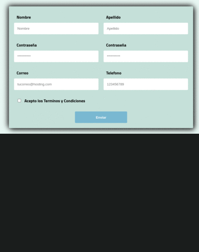

[🇺🇸-English](./readme-EN/README-EN.md)

<h1 align="center">Validación de Formulario </h1>
<p align="center">
   
    
</p>


## Descripción

Formulario con validaciones y manejo de estados con react.
Comparación de input password para verificar su igualdad.
Diseño hecho con styled components, utilizando iconos de fontawesome.

**Pasos para ejecutar el proyecto en tu equipo**

```txt
    1. Forkea el repositorio
    2. Clona el repositorio en tu local
    3. Instala las dependencias con: npm install
    4. Ejecuta: npm start
```

> **_Importante:_** Las dependencias se encuentran en las siguientes versiones:

- **react**: 18.2.0
- **react-dom**: 18.2.0
- **styled-components**: 5.0.1
- **fontawesome**:6.1.2

## Tecnologías ocupadas

- React
- JavaScript
- HTML
- CSS
- STYLED-COMPONENTS

## Autor

| [<br><sub>Emmanuel Arenas</sub>](https://github.com/EmmanuelArenas) |
| :--------------------------------------------------------------------------------------------------------------: |

## Licencia 📄

Licencia: [MIT](License)

## Previsualización

<p align="left">
   
</p>
